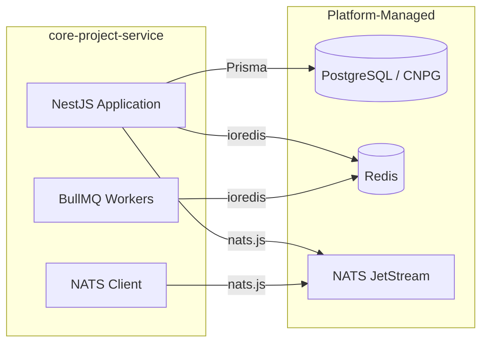
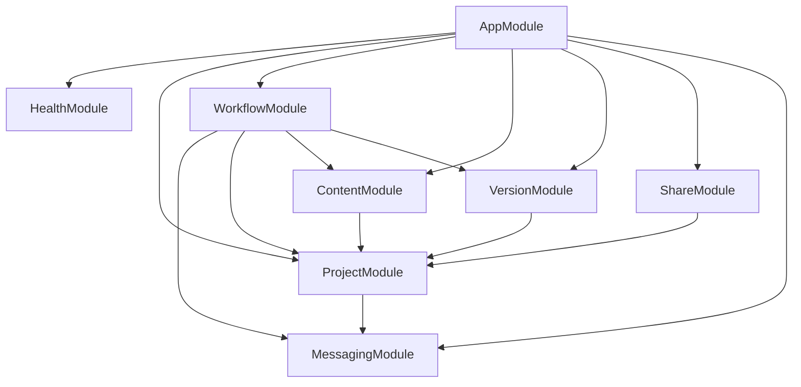
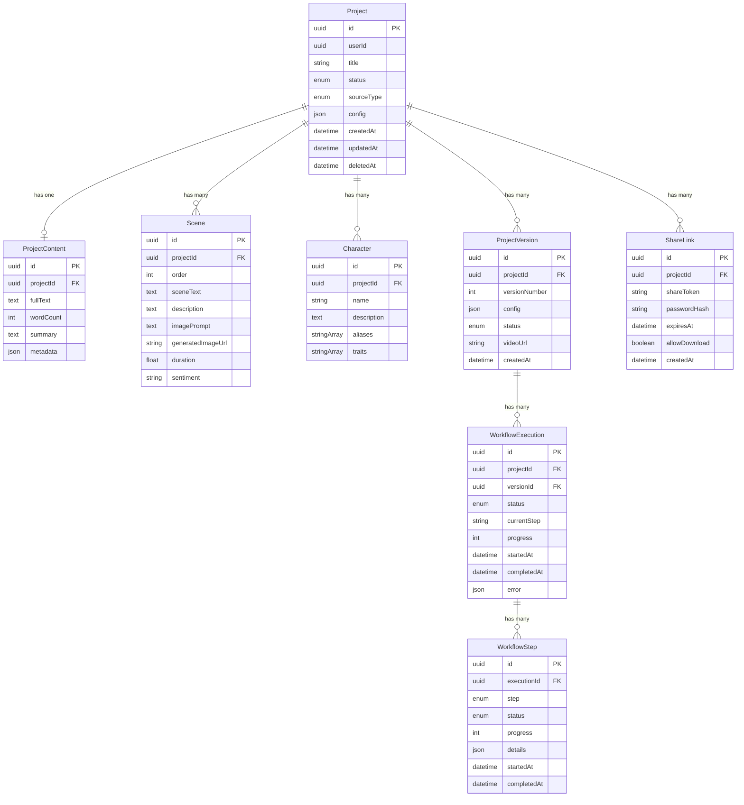
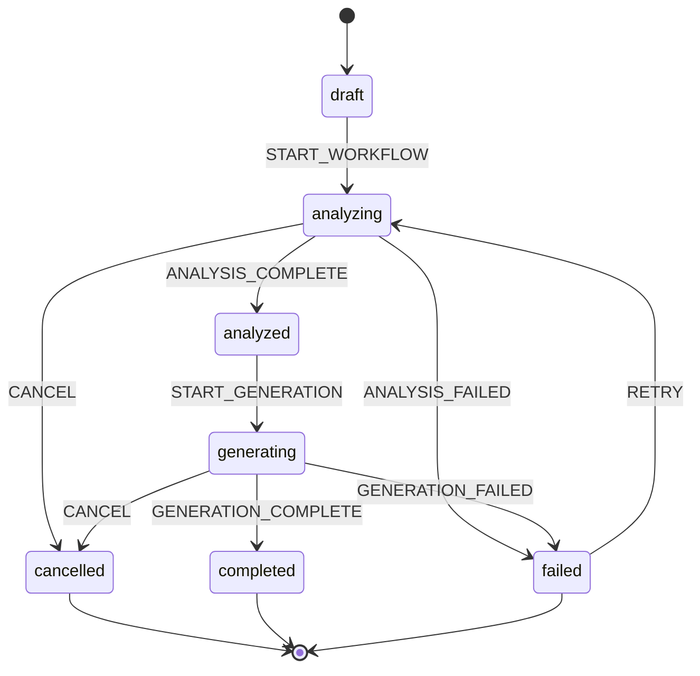
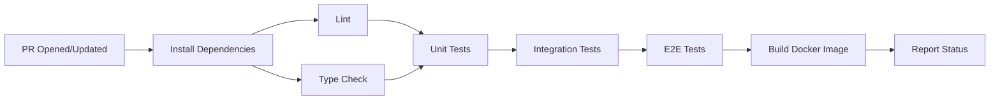

# core-project-service — Architecture Document

## Table of Contents

1. [Service Overview](#1-service-overview)
2. [Technology Stack](#2-technology-stack)
3. [Repository Structure](#3-repository-structure)
4. [Data Model](#4-data-model)
5. [Feature Inventory](#5-feature-inventory)
6. [Feature Priority Matrix](#6-feature-priority-matrix)
7. [Feature Dependency Matrix](#7-feature-dependency-matrix)
8. [API Surface](#8-api-surface)
9. [Workflow Engine](#9-workflow-engine)
10. [NATS JetStream Contract Specification](#10-nats-jetstream-contract-specification)
11. [Inter-Service Communication](#11-inter-service-communication)
12. [CI/CD Pipeline](#12-cicd-pipeline)
13. [Helm Chart Structure](#13-helm-chart-structure)
14. [Testing Strategy](#14-testing-strategy)
15. [Observability](#15-observability)
16. [Configuration](#16-configuration)
17. [Security Considerations](#17-security-considerations)

---

## 1. Service Overview

### Purpose

core-project-service is the central business logic service for VisioBook. It owns the full lifecycle of a **project** — from the moment a user imports content (file upload, camera scan, or text input) through AI-powered analysis, generation orchestration, and final export/sharing. It is the orchestrator that ties the AI pipeline, storage, user quotas, and notifications together.

### Position in Architecture

| Property   | Value                       |
| ---------- | --------------------------- |
| Repository | core-project-service        |
| Port       | 8086                        |
| Phase      | 3 — Metier (Business Logic) |
| Runtime    | Node.js 22 LTS              |
| Framework  | NestJS                      |
| Language   | TypeScript (strict mode)    |

### Responsibilities

- Project CRUD with soft-delete and ownership enforcement
- Content management (extracted text, scenes, characters)
- Workflow orchestration for the multi-step AI generation pipeline
- Version management (multiple generation runs per project)
- Share link management (public, time-limited, password-protected)
- Real-time progress reporting via SSE and HTTP polling
- Inter-service event publishing and subscription via NATS JetStream
- Quota verification before generation

### Owned Flows

| Flow   | Name           | Responsibility                                                          |
| ------ | -------------- | ----------------------------------------------------------------------- |
| Flow 2 | Import File    | Receive uploaded file reference, trigger analysis                       |
| Flow 3 | OCR Scanner    | Receive scanned text, store as project content                          |
| Flow 4 | Configuration  | Manage generation settings (style, audio, duration)                     |
| Flow 5 | Generation     | Orchestrate the full AI pipeline (analysis → images → audio → assembly) |
| Flow 7 | Export / Share | Create share links, manage access                                       |
| Flow 8 | History        | Project listing, search, version history                                |

### What This Service Does NOT Do

- **Does not** handle user authentication or JWT validation — Kong gateway does that
- **Does not** store files on disk — delegates to support-storage-service
- **Does not** run AI models — delegates to ai-analysis-service, ai-media-generation-service, ai-storyboard-assembly-service
- **Does not** send emails or push notifications directly — delegates to core-notification-service
- **Does not** manage payments or subscriptions — delegates to core-payment-service
- **Does not** provision or manage the database, Redis, or NATS — those are platform-managed

---

## 2. Technology Stack

### Application Layer

| Layer             | Choice                       | Rationale                                                                                                                                                                          |
| ----------------- | ---------------------------- | ---------------------------------------------------------------------------------------------------------------------------------------------------------------------------------- |
| Runtime           | Node.js 22 LTS               | Active LTS until 2027. Stable, broad ecosystem.                                                                                                                                    |
| Framework         | NestJS                       | Opinionated module system, dependency injection, first-class TypeScript support. Aligns with the notification service in the same ecosystem.                                       |
| Language          | TypeScript (strict)          | Catch errors at compile time, improve developer experience, required by NestJS.                                                                                                    |
| Package Manager   | pnpm                         | Strict dependency resolution (no phantom deps), faster installs, disk-efficient via content-addressable store.                                                                     |
| ORM               | Prisma                       | Type-safe database client generated from schema, excellent migration tooling, direct connection to CNPG PostgreSQL (no proxy layer).                                               |
| Job Queue         | BullMQ                       | Redis-backed, battle-tested with NestJS (@nestjs/bullmq), supports delayed jobs, retries, rate limiting, and priority queues. Used for internal workflow step orchestration.       |
| State Machine     | XState v5                    | Formal finite state machine for the generation workflow. Provides visualizable statecharts, guards, actions, and serializable state — preventing illegal state transitions.        |
| Validation        | Zod (nestjs-zod)             | Runtime validation with automatic TypeScript type inference from schemas. Single source of truth for types and validation. Integrates with @nestjs/swagger for OpenAPI generation. |
| Logging           | Pino (nestjs-pino)           | Structured JSON logging, extremely fast (low overhead), automatic request context injection.                                                                                       |
| Health Checks     | @nestjs/terminus             | Standardized readiness/liveness probe endpoints for Kubernetes.                                                                                                                    |
| Metrics           | prom-client                  | Prometheus-compatible metrics (counters, histograms, gauges) for monitoring and alerting.                                                                                          |
| API Documentation | @nestjs/swagger + nestjs-zod | Auto-generated OpenAPI spec from Zod DTOs. No manual documentation drift.                                                                                                          |
| HTTP Client       | NestJS HttpModule (Axios)    | For synchronous calls to other services (user quotas, storage operations).                                                                                                         |
| Testing           | Vitest + testcontainers      | Fast test runner with ESM support. testcontainers spins up real PostgreSQL, Redis, and NATS in CI for integration/e2e tests.                                                       |

### Infrastructure Layer

| Component             | Provider                  | Notes                                                                                   |
| --------------------- | ------------------------- | --------------------------------------------------------------------------------------- |
| Database              | CNPG PostgreSQL           | CloudNativePG operator, managed by platform team. Direct Prisma connection.             |
| Cache / Queue Backend | Redis                     | Shared between BullMQ job queue and application caching. Provided by platform team.     |
| Messaging             | NATS JetStream            | Persistent, at-least-once delivery for inter-service events. Provided by platform team. |
| Container Registry    | GitHub Container Registry | Docker images pushed by CI.                                                             |
| Deployment            | ArgoCD                    | GitOps-based, handled by a separate team. This repo provides Helm charts only.          |

### Infrastructure Dependency Diagram



---

## 3. Repository Structure

```
core-project-service/
├── .github/
│   └── workflows/
│       ├── ci.yml                        # PR checks: lint, typecheck, test, build
│       └── release.yml                   # Merge to dev: build + push Docker image
├── helm/
│   ├── Chart.yaml
│   ├── values.yaml                       # Base values
│   ├── values-dev.yaml                   # Dev overrides
│   ├── values-staging.yaml               # Staging overrides
│   ├── values-prod.yaml                  # Prod overrides
│   └── templates/
│       ├── deployment.yaml
│       ├── service.yaml
│       ├── configmap.yaml
│       ├── hpa.yaml
│       ├── secret.yaml
│       └── servicemonitor.yaml
├── prisma/
│   ├── schema.prisma                     # Data model definition
│   └── migrations/                       # Generated migration files
├── src/
│   ├── main.ts                           # Bootstrap, global pipes/filters/interceptors
│   ├── app.module.ts                     # Root module importing all feature modules
│   ├── common/
│   │   ├── config/
│   │   │   └── app.config.ts             # Zod-validated environment configuration
│   │   ├── decorators/
│   │   │   └── current-user.decorator.ts # Extract userId from request header
│   │   ├── filters/
│   │   │   └── http-exception.filter.ts  # Global exception formatting
│   │   ├── guards/
│   │   │   └── gateway-auth.guard.ts     # Reject requests without X-User-Id
│   │   ├── interceptors/
│   │   │   └── logging.interceptor.ts    # Request/response logging
│   │   ├── pipes/
│   │   │   └── zod-validation.pipe.ts    # Zod schema validation pipe
│   │   └── types/
│   │       └── index.ts                  # Shared type definitions
│   ├── health/
│   │   └── health.module.ts              # Terminus health checks (DB, Redis, NATS)
│   ├── project/
│   │   ├── project.module.ts
│   │   ├── project.controller.ts         # /api/v1/projects/*
│   │   ├── project.service.ts
│   │   └── dto/
│   │       ├── create-project.dto.ts
│   │       ├── update-project.dto.ts
│   │       └── project-response.dto.ts
│   ├── workflow/
│   │   ├── workflow.module.ts
│   │   ├── workflow.controller.ts        # /api/v1/projects/:id/versions/:vid/workflow/*
│   │   ├── workflow.service.ts
│   │   ├── workflow.processor.ts         # BullMQ job processor
│   │   ├── workflow.machine.ts           # XState v5 state machine definition
│   │   ├── workflow.sse.controller.ts    # SSE endpoint for real-time progress
│   │   └── dto/
│   ├── content/
│   │   ├── content.module.ts
│   │   ├── content.controller.ts         # /api/v1/projects/:id/content/*
│   │   ├── content.service.ts
│   │   └── dto/
│   ├── version/
│   │   ├── version.module.ts
│   │   ├── version.controller.ts         # /api/v1/projects/:id/versions/*
│   │   ├── version.service.ts
│   │   └── dto/
│   ├── share/
│   │   ├── share.module.ts
│   │   ├── share.controller.ts           # /api/v1/projects/:id/share/* and /api/v1/shared/:token
│   │   ├── share.service.ts
│   │   └── dto/
│   ├── messaging/
│   │   ├── messaging.module.ts
│   │   ├── nats.publisher.ts             # Publish events to NATS JetStream
│   │   ├── nats.subscriber.ts            # Subscribe to AI pipeline events
│   │   └── subjects.ts                   # NATS subject string constants
│   └── clients/
│       ├── user-service.client.ts        # HTTP client for core-user-service
│       ├── storage-service.client.ts     # HTTP client for support-storage-service
│       └── notification-service.client.ts # HTTP client for core-notification-service
├── test/
│   ├── unit/                             # Unit tests (mocked dependencies)
│   ├── integration/                      # Tests with testcontainers
│   └── e2e/                              # Full HTTP request cycle tests
├── Dockerfile                            # Multi-stage production build
├── docker-compose.dev.yml                # Local dev: Postgres, Redis, NATS
├── .env.example                          # Documented environment variables
├── tsconfig.json
├── vitest.config.ts
├── package.json
└── ARCHITECTURE.md                       # This file
```

### Module Dependency Graph



---

## 4. Data Model

### Entities

#### Project

The root entity representing a user's VisioBook project.

| Field      | Type                           | Description                                                    |
| ---------- | ------------------------------ | -------------------------------------------------------------- |
| id         | UUID                           | Primary key                                                    |
| userId     | UUID                           | Owner (from X-User-Id header). Indexed.                        |
| title      | String                         | User-defined project title                                     |
| status     | Enum (draft, active, archived) | Simple project-level status. Not the workflow state.           |
| sourceType | Enum (file, scan, text)        | How the content was originally provided                        |
| config     | JSON                           | Generation preferences (style, audio settings, duration, etc.) |
| createdAt  | DateTime                       | Creation timestamp                                             |
| updatedAt  | DateTime                       | Last modification timestamp                                    |
| deletedAt  | DateTime (nullable)            | Soft-delete timestamp. Null when active.                       |

#### ProjectContent

Extracted and processed text content for a project. One-to-one with Project.

| Field     | Type                | Description                                             |
| --------- | ------------------- | ------------------------------------------------------- |
| id        | UUID                | Primary key                                             |
| projectId | UUID (FK → Project) | Parent project. Unique constraint.                      |
| text      | Text                | Full extracted text content                             |
| wordCount | Integer             | Computed word count                                     |
| summary   | Text (nullable)     | AI-generated summary                                    |
| metadata  | JSON                | Source file info, extraction details, language detected |

#### Scene

An individual scene extracted from the project content by AI analysis. One project has many scenes.

| Field             | Type                | Description                                            |
| ----------------- | ------------------- | ------------------------------------------------------ |
| id                | UUID                | Primary key                                            |
| projectId         | UUID (FK → Project) | Parent project                                         |
| order             | Integer             | Scene sequence number (1-based)                        |
| text              | Text                | Scene text content                                     |
| description       | Text                | AI-generated visual description                        |
| imagePrompt       | Text                | Prompt used/to use for image generation                |
| generatedImageUrl | String (nullable)   | URL of the generated image in storage                  |
| duration          | Float               | Scene duration in seconds                              |
| sentiment         | String (nullable)   | Detected sentiment (positive, negative, neutral, etc.) |

#### Character

A character extracted from the project content by AI analysis. One project has many characters.

| Field       | Type                | Description                                |
| ----------- | ------------------- | ------------------------------------------ |
| id          | UUID                | Primary key                                |
| projectId   | UUID (FK → Project) | Parent project                             |
| name        | String              | Character name                             |
| description | Text                | Character description                      |
| aliases     | String[]            | Alternative names or references            |
| traits      | String[]            | Character traits for consistent generation |

#### ProjectVersion

A snapshot of a generation run. Each version captures the config used and the resulting output. One project has many versions. **The workflow state machine operates on this entity, not on Project.**

| Field         | Type                                                                                     | Description                                          |
| ------------- | ---------------------------------------------------------------------------------------- | ---------------------------------------------------- |
| id            | UUID                                                                                     | Primary key                                          |
| projectId     | UUID (FK → Project)                                                                      | Parent project                                       |
| versionNumber | Integer                                                                                  | Auto-incrementing within the project (1, 2, 3...)    |
| config        | JSON                                                                                     | Frozen copy of generation config at time of creation |
| status        | Enum (draft, analyzing, analyzed, configuring, generating, completed, failed, cancelled) | XState-managed workflow status                       |
| videoUrl      | String (nullable)                                                                        | Final assembled video URL in storage                 |
| createdAt     | DateTime                                                                                 | Version creation timestamp                           |

#### WorkflowExecution

Tracks a single execution run of the generation pipeline for a version. One version may have multiple executions (e.g., after retry).

| Field       | Type                                                  | Description                                  |
| ----------- | ----------------------------------------------------- | -------------------------------------------- |
| id          | UUID                                                  | Primary key                                  |
| projectId   | UUID (FK → Project)                                   | Parent project                               |
| versionId   | UUID (FK → ProjectVersion)                            | Parent version                               |
| status      | Enum (pending, running, completed, failed, cancelled) | Execution-level status                       |
| currentStep | String (nullable)                                     | Current pipeline step name                   |
| progress    | Integer (0–100)                                       | Overall progress percentage                  |
| startedAt   | DateTime (nullable)                                   | When execution began                         |
| completedAt | DateTime (nullable)                                   | When execution finished (success or failure) |
| error       | JSON (nullable)                                       | Error details if failed                      |

#### WorkflowStep

Individual step within a workflow execution. Provides granular progress tracking.

| Field       | Type                                                                                                  | Description                                            |
| ----------- | ----------------------------------------------------------------------------------------------------- | ------------------------------------------------------ |
| id          | UUID                                                                                                  | Primary key                                            |
| executionId | UUID (FK → WorkflowExecution)                                                                         | Parent execution                                       |
| step        | Enum (analysis, scene_extraction, character_extraction, image_generation, audio_generation, assembly) | Pipeline step type                                     |
| status      | Enum (pending, running, completed, failed, skipped)                                                   | Step-level status                                      |
| progress    | Integer (0–100)                                                                                       | Step-specific progress                                 |
| details     | JSON (nullable)                                                                                       | Step-specific metadata (e.g., scene count, image URLs) |
| startedAt   | DateTime (nullable)                                                                                   | Step start time                                        |
| completedAt | DateTime (nullable)                                                                                   | Step completion time                                   |

#### ShareLink

A shareable link granting access to a project's latest completed version.

| Field         | Type                | Description                                 |
| ------------- | ------------------- | ------------------------------------------- |
| id            | UUID                | Primary key                                 |
| projectId     | UUID (FK → Project) | Parent project                              |
| shareToken    | String (unique)     | URL-safe token for public access            |
| passwordHash  | String (nullable)   | bcrypt hash if password-protected           |
| expiresAt     | DateTime (nullable) | Expiration timestamp. Null means no expiry. |
| allowDownload | Boolean             | Whether the viewer can download the video   |
| createdAt     | DateTime            | Link creation timestamp                     |

### Entity Relationship Diagram



---

## 5. Feature Inventory

### Domain: Project Management

| ID      | Feature                 | Description                                                                                                                     |
| ------- | ----------------------- | ------------------------------------------------------------------------------------------------------------------------------- |
| F-PM-01 | Create project          | Accept source content (file reference, scanned text, or raw text), create Project + ProjectContent records, set status to draft |
| F-PM-02 | Get project by ID       | Return project with ownership check (userId must match X-User-Id)                                                               |
| F-PM-03 | List projects           | Paginated list of user's projects, sorted by updatedAt descending. Supports cursor-based or offset pagination.                  |
| F-PM-04 | Update project          | Update title and/or config. Only allowed when no workflow is currently running.                                                 |
| F-PM-05 | Delete project          | Soft-delete (set deletedAt). Trigger async cleanup of associated storage files via NATS event.                                  |
| F-PM-06 | Search projects         | Full-text search across project title and content text. PostgreSQL tsvector-based.                                              |
| F-PM-07 | Project status tracking | Derive project status from its versions: draft (no versions), active (has versions), archived (user-initiated)                  |

### Domain: Content Management

| ID      | Feature                   | Description                                                                  |
| ------- | ------------------------- | ---------------------------------------------------------------------------- |
| F-CM-01 | Retrieve project content  | Return the ProjectContent record for a given project                         |
| F-CM-02 | Update project content    | Allow editing extracted text before generation                               |
| F-CM-03 | Get content summary       | Return the AI-generated summary of the project content                       |
| F-CM-04 | List extracted scenes     | Return ordered list of Scene records for a project                           |
| F-CM-05 | Update individual scene   | Allow editing a scene's text, description, or image prompt before generation |
| F-CM-06 | List extracted characters | Return Character records for a project                                       |

### Domain: Workflow Engine

| ID      | Feature                        | Description                                                                                                                                                        |
| ------- | ------------------------------ | ------------------------------------------------------------------------------------------------------------------------------------------------------------------ |
| F-WF-01 | Start generation workflow      | Create a new ProjectVersion, initialize WorkflowExecution, enqueue the first BullMQ job, transition XState machine to analyzing                                    |
| F-WF-02 | Workflow state machine         | XState v5 machine defining legal states and transitions for a version's lifecycle. Prevents invalid transitions. Serialized to ProjectVersion.status.              |
| F-WF-03 | BullMQ job processing          | Multi-step job processor that advances through the pipeline (analysis → scene extraction → image gen → audio gen → assembly). Each step is a separate BullMQ job.  |
| F-WF-04 | Workflow progress tracking     | Aggregate progress from WorkflowStep records. Update WorkflowExecution.progress as steps complete.                                                                 |
| F-WF-05 | Cancel running workflow        | Transition XState to cancelled, remove pending BullMQ jobs, publish cancellation event via NATS                                                                    |
| F-WF-06 | Retry failed workflow          | Create a new WorkflowExecution for the same version, re-enqueue from the failed step                                                                               |
| F-WF-07 | SSE real-time progress stream  | Server-Sent Events endpoint streaming progress updates for a version's workflow. Client receives progress percentage, current step, and step details in real time. |
| F-WF-08 | HTTP polling progress endpoint | GET endpoint returning current workflow status, progress percentage, and step breakdown. Fallback for clients that cannot use SSE.                                 |
| F-WF-09 | Quota check before generation  | Call core-user-service to verify the user has remaining generation credits before starting a workflow                                                              |

### Domain: Version Management

| ID      | Feature                    | Description                                                                                |
| ------- | -------------------------- | ------------------------------------------------------------------------------------------ |
| F-VM-01 | Create project version     | Snapshot the current config into a new ProjectVersion with auto-incremented version number |
| F-VM-02 | List project versions      | Return all versions for a project, ordered by versionNumber descending                     |
| F-VM-03 | Get version details        | Return a specific version with its workflow executions and steps                           |
| F-VM-04 | Compare versions           | Return diff between two version configs                                                    |
| F-VM-05 | Revert to previous version | Copy a previous version's config back to the project's current config                      |

### Domain: Sharing

| ID      | Feature                                   | Description                                                                                                     |
| ------- | ----------------------------------------- | --------------------------------------------------------------------------------------------------------------- |
| F-SH-01 | Create share link                         | Generate a URL-safe token, optionally set expiry and download permission                                        |
| F-SH-02 | Create password-protected share link      | Same as F-SH-01 but with a bcrypt-hashed password                                                               |
| F-SH-03 | Get share link info                       | Return share link metadata (expiry, download allowed, creation date)                                            |
| F-SH-04 | Delete share link                         | Revoke a share link                                                                                             |
| F-SH-05 | Public access via share link              | Unauthenticated endpoint: given a valid token, return the project's latest completed version data and video URL |
| F-SH-06 | Password verification for protected links | Verify the provided password against the stored hash before granting access                                     |

### Domain: Inter-Service Communication

| ID      | Feature                                  | Description                                                                                                                                                    |
| ------- | ---------------------------------------- | -------------------------------------------------------------------------------------------------------------------------------------------------------------- |
| F-IS-01 | NATS JetStream publisher                 | Publish workflow lifecycle events (started, step_completed, completed, failed, cancelled) to NATS subjects                                                     |
| F-IS-02 | NATS JetStream subscriber                | Subscribe to AI pipeline response events (analysis.completed, media.image.completed, media.audio.completed, assembly.completed, etc.) and advance the workflow |
| F-IS-03 | HTTP client to core-user-service         | Check user quota (GET /api/v1/users/:id/quota) and decrement after successful generation                                                                       |
| F-IS-04 | HTTP client to support-storage-service   | Request signed upload URLs, trigger file deletion on project cleanup, retrieve file metadata                                                                   |
| F-IS-05 | HTTP client to core-notification-service | Send push/email notifications on generation complete or failure                                                                                                |
| F-IS-06 | AI pipeline callback handling            | Process incoming NATS events from AI services, update WorkflowStep records, advance the BullMQ pipeline                                                        |

### Domain: Infrastructure

| ID      | Feature                            | Description                                                                                                        |
| ------- | ---------------------------------- | ------------------------------------------------------------------------------------------------------------------ |
| F-IF-01 | Health check endpoints             | `/health/ready` (checks DB, Redis, NATS connectivity) and `/health/live` (process is alive) via @nestjs/terminus   |
| F-IF-02 | Prometheus metrics endpoint        | `/metrics` exposing request count, latency histograms, workflow durations, queue depths, active connections        |
| F-IF-03 | Structured JSON logging            | Pino logger with automatic request context (correlationId, userId, method, path) on every log line                 |
| F-IF-04 | OpenAPI/Swagger documentation      | Auto-generated from Zod DTOs via nestjs-zod. Available at `/api/docs` in non-production environments.              |
| F-IF-05 | Request correlation ID propagation | Extract X-Request-Id from gateway, attach to all logs and outbound HTTP/NATS headers                               |
| F-IF-06 | Graceful shutdown                  | On SIGTERM: stop accepting new requests, drain BullMQ workers, close NATS connection, disconnect Prisma, then exit |
| F-IF-07 | Environment configuration          | Zod schema validating all environment variables at startup. Fail fast on missing or invalid config.                |
| F-IF-08 | Redis caching layer                | Cache frequently accessed data (project details, content summaries) with TTL-based invalidation                    |

### Domain: Security & Validation

| ID      | Feature                          | Description                                                                                                                                    |
| ------- | -------------------------------- | ---------------------------------------------------------------------------------------------------------------------------------------------- |
| F-SV-01 | Gateway auth guard               | NestJS guard that rejects requests without a valid X-User-Id header. Applied globally.                                                         |
| F-SV-02 | Zod request validation pipe      | Global pipe that validates request bodies, query params, and route params against Zod schemas                                                  |
| F-SV-03 | Input sanitization               | Strip dangerous content from user-provided text fields (HTML tags, script injections)                                                          |
| F-SV-04 | Rate limiting headers forwarding | Forward X-RateLimit-\* headers from Kong gateway responses for client awareness                                                                |
| F-SV-05 | Ownership validation             | Every project access verifies that the requesting user owns the project. Returns 404 (not 403) for non-owned resources to prevent enumeration. |

### Domain: CI/CD & DevOps

| ID      | Feature                       | Description                                                                                                          |
| ------- | ----------------------------- | -------------------------------------------------------------------------------------------------------------------- |
| F-CD-01 | GitHub Actions CI pipeline    | Lint (ESLint + Prettier) → Type check (tsc --noEmit) → Unit tests → Integration/E2E tests → Docker build             |
| F-CD-02 | Docker multi-stage build      | Stage 1: install + build. Stage 2: production image with only compiled output and node_modules.                      |
| F-CD-03 | Helm chart (service-only)     | Deployment, Service, ConfigMap, HPA, Secret, ServiceMonitor. No bundled infrastructure (Postgres, Redis, NATS).      |
| F-CD-04 | Environment-specific values   | Separate values files for dev, staging, and prod with appropriate resource limits, replica counts, and feature flags |
| F-CD-05 | E2E tests with testcontainers | Spin up real PostgreSQL, Redis, and NATS containers in CI for integration testing. No mocks for infrastructure.      |

---

## 6. Feature Priority Matrix

### Priority Definitions

| Priority | Label        | Criteria                                              |
| -------- | ------------ | ----------------------------------------------------- |
| **P0**   | Must Have    | Foundational. Blocks all other features. Build first. |
| **P1**   | Critical     | Core user-facing functionality. Required for MVP.     |
| **P2**   | Important    | Enhances core experience. Ship shortly after MVP.     |
| **P3**   | Nice to Have | Polish, optimization, advanced features.              |

### P0 — Foundational

These features must be built first. All other features depend on them.

| ID      | Feature                                   |
| ------- | ----------------------------------------- |
| F-IF-07 | Environment configuration (Zod-validated) |
| F-IF-01 | Health check endpoints                    |
| F-IF-03 | Structured JSON logging (Pino)            |
| F-SV-01 | Gateway auth guard                        |
| F-SV-02 | Zod request validation pipe               |
| F-CD-01 | GitHub Actions CI pipeline                |
| F-CD-02 | Docker multi-stage build                  |
| F-CD-03 | Helm chart                                |
| —       | Prisma schema + initial migration         |

### P1 — Core MVP

Core user-facing features required for a functional product.

| ID      | Feature                                |
| ------- | -------------------------------------- |
| F-PM-01 | Create project                         |
| F-PM-02 | Get project by ID                      |
| F-PM-03 | List projects (paginated)              |
| F-PM-04 | Update project                         |
| F-PM-05 | Delete project (soft delete)           |
| F-CM-01 | Retrieve project content               |
| F-CM-02 | Update project content                 |
| F-CM-04 | List extracted scenes                  |
| F-WF-01 | Start generation workflow              |
| F-WF-02 | Workflow state machine (XState v5)     |
| F-WF-03 | BullMQ job processing                  |
| F-WF-04 | Workflow progress tracking             |
| F-WF-08 | HTTP polling progress endpoint         |
| F-WF-09 | Quota check before generation          |
| F-VM-01 | Create project version                 |
| F-VM-02 | List project versions                  |
| F-VM-03 | Get version details                    |
| F-IS-01 | NATS JetStream publisher               |
| F-IS-02 | NATS JetStream subscriber              |
| F-IS-03 | HTTP client to core-user-service       |
| F-IS-04 | HTTP client to support-storage-service |
| F-SV-05 | Ownership validation                   |

### P2 — Extended MVP

Enhances the core experience. Should ship shortly after the initial MVP.

| ID      | Feature                                  |
| ------- | ---------------------------------------- |
| F-PM-06 | Search projects (full-text)              |
| F-CM-03 | Get content summary                      |
| F-CM-05 | Update individual scene                  |
| F-CM-06 | List extracted characters                |
| F-WF-05 | Cancel running workflow                  |
| F-WF-06 | Retry failed workflow                    |
| F-WF-07 | SSE real-time progress stream            |
| F-SH-01 | Create share link                        |
| F-SH-05 | Public access via share link             |
| F-IS-05 | HTTP client to core-notification-service |
| F-IS-06 | AI pipeline callback handling            |
| F-IF-02 | Prometheus metrics endpoint              |
| F-IF-04 | OpenAPI/Swagger documentation            |
| F-IF-05 | Request correlation ID propagation       |
| F-IF-06 | Graceful shutdown                        |
| F-CD-04 | Environment-specific values              |
| F-CD-05 | E2E tests with testcontainers            |

### P3 — Polish

Advanced features, optimization, and edge cases.

| ID      | Feature                            |
| ------- | ---------------------------------- |
| F-SH-02 | Password-protected share links     |
| F-SH-03 | Get share link info                |
| F-SH-04 | Delete share link                  |
| F-SH-06 | Password verification              |
| F-VM-04 | Compare versions                   |
| F-VM-05 | Revert to previous version         |
| F-IF-08 | Redis caching layer                |
| F-SV-03 | Input sanitization                 |
| F-SV-04 | Rate limiting headers forwarding   |
| F-PM-07 | Project status tracking (advanced) |

---

## 7. Feature Dependency Matrix

The following diagram shows which features depend on which. An arrow from A to B means "A must be built before B."

```mermaid
graph TD
    subgraph "P0 — Foundational"
        CONFIG[F-IF-07<br/>Env Config]
        HEALTH[F-IF-01<br/>Health Checks]
        LOG[F-IF-03<br/>Logging]
        GUARD[F-SV-01<br/>Auth Guard]
        VALID[F-SV-02<br/>Validation Pipe]
        CI[F-CD-01<br/>CI Pipeline]
        DOCKER[F-CD-02<br/>Docker Build]
        HELM[F-CD-03<br/>Helm Chart]
        SCHEMA[Prisma Schema<br/>+ Migration]
    end

    subgraph "P1 — Core MVP: Project"
        PM01[F-PM-01<br/>Create Project]
        PM02[F-PM-02<br/>Get Project]
        PM03[F-PM-03<br/>List Projects]
        PM04[F-PM-04<br/>Update Project]
        PM05[F-PM-05<br/>Delete Project]
    end

    subgraph "P1 — Core MVP: Content"
        CM01[F-CM-01<br/>Get Content]
        CM02[F-CM-02<br/>Update Content]
        CM04[F-CM-04<br/>List Scenes]
    end

    subgraph "P1 — Core MVP: Workflow"
        WF01[F-WF-01<br/>Start Workflow]
        WF02[F-WF-02<br/>State Machine]
        WF03[F-WF-03<br/>BullMQ Processor]
        WF04[F-WF-04<br/>Progress Tracking]
        WF08[F-WF-08<br/>Polling Endpoint]
        WF09[F-WF-09<br/>Quota Check]
    end

    subgraph "P1 — Core MVP: Version"
        VM01[F-VM-01<br/>Create Version]
        VM02[F-VM-02<br/>List Versions]
        VM03[F-VM-03<br/>Get Version]
    end

    subgraph "P1 — Core MVP: Integration"
        IS01[F-IS-01<br/>NATS Publisher]
        IS02[F-IS-02<br/>NATS Subscriber]
        IS03[F-IS-03<br/>User Client]
        IS04[F-IS-04<br/>Storage Client]
        SV05[F-SV-05<br/>Ownership Check]
    end

    subgraph "P2 — Extended MVP"
        PM06[F-PM-06<br/>Search]
        CM03[F-CM-03<br/>Summary]
        CM05[F-CM-05<br/>Update Scene]
        CM06[F-CM-06<br/>Characters]
        WF05[F-WF-05<br/>Cancel]
        WF06[F-WF-06<br/>Retry]
        WF07[F-WF-07<br/>SSE Stream]
        SH01[F-SH-01<br/>Share Link]
        SH05[F-SH-05<br/>Public Access]
        IS05[F-IS-05<br/>Notif Client]
        IS06[F-IS-06<br/>AI Callback]
        IF02[F-IF-02<br/>Metrics]
        IF04[F-IF-04<br/>Swagger]
        IF05[F-IF-05<br/>Correlation ID]
        IF06[F-IF-06<br/>Graceful Shutdown]
        CD04[F-CD-04<br/>Env Values]
        CD05[F-CD-05<br/>E2E Tests]
    end

    subgraph "P3 — Polish"
        SH02[F-SH-02<br/>Password Share]
        SH03[F-SH-03<br/>Share Info]
        SH04[F-SH-04<br/>Delete Share]
        SH06[F-SH-06<br/>Password Verify]
        VM04[F-VM-04<br/>Compare Versions]
        VM05[F-VM-05<br/>Revert Version]
        IF08[F-IF-08<br/>Redis Cache]
        SV03[F-SV-03<br/>Sanitization]
    end

    %% P0 → P1 dependencies
    CONFIG --> SCHEMA
    CONFIG --> GUARD
    CONFIG --> VALID
    SCHEMA --> PM01
    SCHEMA --> CM01
    SCHEMA --> VM01
    GUARD --> PM01
    VALID --> PM01
    LOG --> PM01

    %% Project CRUD chain
    PM01 --> PM02
    PM01 --> PM03
    PM01 --> PM04
    PM01 --> PM05
    PM02 --> SV05

    %% Content depends on Project
    PM01 --> CM01
    CM01 --> CM02
    CM01 --> CM04

    %% Version depends on Project
    PM01 --> VM01
    VM01 --> VM02
    VM01 --> VM03

    %% Workflow depends on Version + BullMQ + XState + NATS
    VM01 --> WF01
    WF02 --> WF01
    WF03 --> WF01
    IS01 --> WF01
    IS03 --> WF09
    WF09 --> WF01
    WF01 --> WF04
    WF04 --> WF08
    IS02 --> WF03

    %% P2 dependencies
    PM03 --> PM06
    CM01 --> CM03
    CM04 --> CM05
    CM01 --> CM06
    WF01 --> WF05
    WF01 --> WF06
    WF08 --> WF07
    PM02 --> SH01
    SH01 --> SH05
    WF01 --> IS05
    IS02 --> IS06
    VALID --> IF04
    HELM --> CD04

    %% P3 dependencies
    SH01 --> SH02
    SH01 --> SH03
    SH01 --> SH04
    SH02 --> SH06
    VM02 --> VM04
    VM03 --> VM05
```



### Key Dependency Chains

1. **Config → Schema → Project CRUD → Content/Version → Workflow → Progress → SSE**
   The longest critical path. Every feature ultimately depends on a working Prisma schema and project creation.

2. **XState + BullMQ + NATS Publisher → Start Workflow**
   The workflow engine requires all three components to be ready before the first generation can run.

3. **NATS Subscriber → BullMQ Processor**
   AI pipeline responses arrive via NATS and must be routed to the correct BullMQ job to advance the pipeline.

4. **Quota Check → Start Workflow**
   User service HTTP client must be functional before generation can begin.

5. **Share Link → Public Access → Password Protection**
   Sharing features build on each other incrementally.

---

## 8. API Surface

All endpoints are prefixed with `/api/v1`. Authentication is enforced via the gateway auth guard (X-User-Id header) unless noted otherwise.

### ProjectController — `/api/v1/projects`

| Method | Endpoint  | Description                      | Auth         |
| ------ | --------- | -------------------------------- | ------------ |
| POST   | `/`       | Create a new project             | User         |
| GET    | `/`       | List user's projects (paginated) | User         |
| GET    | `/search` | Full-text search across projects | User         |
| GET    | `/:id`    | Get project by ID                | User (owner) |
| PATCH  | `/:id`    | Update project (title, config)   | User (owner) |
| DELETE | `/:id`    | Soft-delete project              | User (owner) |

### ContentController — `/api/v1/projects/:projectId/content`

| Method | Endpoint           | Description                 | Auth         |
| ------ | ------------------ | --------------------------- | ------------ |
| GET    | `/`                | Get project content         | User (owner) |
| PATCH  | `/`                | Update project content text | User (owner) |
| GET    | `/summary`         | Get AI-generated summary    | User (owner) |
| GET    | `/scenes`          | List extracted scenes       | User (owner) |
| PATCH  | `/scenes/:sceneId` | Update a single scene       | User (owner) |
| GET    | `/characters`      | List extracted characters   | User (owner) |

### VersionController — `/api/v1/projects/:projectId/versions`

| Method | Endpoint             | Description                            | Auth         |
| ------ | -------------------- | -------------------------------------- | ------------ |
| POST   | `/`                  | Create a new version (snapshot config) | User (owner) |
| GET    | `/`                  | List all versions                      | User (owner) |
| GET    | `/:versionId`        | Get version details with executions    | User (owner) |
| GET    | `/:v1/compare/:v2`   | Compare two version configs            | User (owner) |
| POST   | `/:versionId/revert` | Revert project config to this version  | User (owner) |

### WorkflowController — `/api/v1/projects/:projectId/versions/:versionId/workflow`

| Method | Endpoint  | Description                                | Auth         |
| ------ | --------- | ------------------------------------------ | ------------ |
| POST   | `/start`  | Start generation workflow                  | User (owner) |
| GET    | `/status` | Get workflow status and progress (polling) | User (owner) |
| POST   | `/cancel` | Cancel running workflow                    | User (owner) |
| POST   | `/retry`  | Retry failed workflow                      | User (owner) |

### WorkflowSSEController — `/api/v1/projects/:projectId/versions/:versionId/workflow`

| Method | Endpoint           | Description                      | Auth         |
| ------ | ------------------ | -------------------------------- | ------------ |
| GET    | `/progress/stream` | SSE stream of real-time progress | User (owner) |

### ShareController — `/api/v1/projects/:projectId/share`

| Method | Endpoint | Description         | Auth         |
| ------ | -------- | ------------------- | ------------ |
| POST   | `/`      | Create share link   | User (owner) |
| GET    | `/`      | Get share link info | User (owner) |
| DELETE | `/`      | Delete share link   | User (owner) |

### ShareController (Public) — `/api/v1/shared`

| Method | Endpoint         | Description                        | Auth |
| ------ | ---------------- | ---------------------------------- | ---- |
| GET    | `/:token`        | Access shared project (public)     | None |
| POST   | `/:token/verify` | Verify password for protected link | None |

### HealthController — `/health`

| Method | Endpoint | Description                         | Auth |
| ------ | -------- | ----------------------------------- | ---- |
| GET    | `/ready` | Readiness probe (DB + Redis + NATS) | None |
| GET    | `/live`  | Liveness probe (process alive)      | None |

### MetricsController — `/metrics`

| Method | Endpoint | Description                        | Auth            |
| ------ | -------- | ---------------------------------- | --------------- |
| GET    | `/`      | Prometheus metrics scrape endpoint | None (internal) |

---

## 9. Workflow Engine

### Design Overview

The workflow engine is the most complex subsystem in core-project-service. It combines three technologies:

- **XState v5** defines the legal states and transitions for a version's lifecycle. It prevents invalid state changes (e.g., jumping from "draft" to "completed") and provides a visualizable statechart.
- **BullMQ** handles the actual job execution. Each pipeline step is a separate job. BullMQ provides retries, rate limiting, concurrency control, and dead-letter queuing.
- **NATS JetStream** connects the workflow to external AI services. core-project-service publishes events when it needs work done and subscribes to completion events from AI services.

### XState v5 Statechart

The state machine operates on **ProjectVersion**, not on Project.



### State Descriptions

| State          | Description                                                                               | Entry Action                                                  | Exit Action |
| -------------- | ----------------------------------------------------------------------------------------- | ------------------------------------------------------------- | ----------- |
| **draft**      | Version created, config snapshotted. Waiting for user to start.                           | Create WorkflowExecution record                               | —           |
| **analyzing**  | AI analysis pipeline running (semantic analysis, scene extraction, character extraction). | Enqueue analysis BullMQ job, publish NATS event               | —           |
| **analyzed**   | Analysis complete. Scenes and characters extracted. Waiting for generation start.         | Update WorkflowStep records                                   | —           |
| **generating** | Media generation pipeline running (images, audio, video assembly).                        | Enqueue image generation job, publish NATS event              | —           |
| **completed**  | All steps finished. Video URL available.                                                  | Set videoUrl on version, notify user via notification service | —           |
| **failed**     | A step failed after exhausting retries.                                                   | Record error details on WorkflowExecution                     | —           |
| **cancelled**  | User cancelled the workflow.                                                              | Remove pending BullMQ jobs, publish cancellation NATS event   | —           |

### State Transition Guards

| Transition            | Guard          | Description                                          |
| --------------------- | -------------- | ---------------------------------------------------- |
| draft → analyzing     | hasContent     | Project must have ProjectContent with non-empty text |
| draft → analyzing     | hasQuota       | User must have remaining generation credits          |
| analyzed → generating | hasScenes      | At least one Scene must exist                        |
| failed → analyzing    | isRetryAllowed | Max retry count not exceeded                         |

### BullMQ Job Types

Each pipeline step maps to a BullMQ job type. Jobs are processed sequentially within a version's workflow execution.

| Job Type                    | Pipeline Step    | Input                                             | Output                      | Next Job                    |
| --------------------------- | ---------------- | ------------------------------------------------- | --------------------------- | --------------------------- |
| `workflow:analysis`         | Analysis         | projectId, versionId, text                        | Scenes, characters, summary | `workflow:image-generation` |
| `workflow:image-generation` | Image Generation | projectId, versionId, scenes                      | Image URLs per scene        | `workflow:audio-generation` |
| `workflow:audio-generation` | Audio Generation | projectId, versionId, scenes, config              | Audio URL                   | `workflow:assembly`         |
| `workflow:assembly`         | Video Assembly   | projectId, versionId, scenes (with images), audio | Video URL                   | (none — workflow complete)  |

### BullMQ Configuration

| Setting              | Value                     | Rationale                                               |
| -------------------- | ------------------------- | ------------------------------------------------------- |
| Queue name           | `project-workflow`        | Single queue for all workflow jobs                      |
| Concurrency          | 5                         | Process up to 5 workflows simultaneously                |
| Max retries per job  | 3                         | Retry transient failures (network, AI service overload) |
| Backoff strategy     | Exponential (1s, 4s, 16s) | Avoid hammering failing services                        |
| Job timeout          | 5 minutes per step        | Prevent stuck jobs                                      |
| Stalled job interval | 30 seconds                | Detect workers that crash mid-job                       |

### Progress Reporting Strategy

Overall progress is computed as a weighted sum of step completions:

| Step             | Weight | Rationale                          |
| ---------------- | ------ | ---------------------------------- |
| Analysis         | 15%    | Fast (text processing only)        |
| Image Generation | 40%    | Slowest step (one image per scene) |
| Audio Generation | 20%    | Moderate (TTS + music generation)  |
| Assembly         | 25%    | FFmpeg encoding                    |

Within each step, progress is reported as 0–100% and normalized by the step's weight. For image generation, progress increments per scene (e.g., 5 scenes = 20% per scene × 40% weight = 8% overall per scene).

---

## 10. NATS JetStream Contract Specification

### Stream Configuration

| Property       | Value                        |
| -------------- | ---------------------------- |
| Stream Name    | `VISIOBOOK_PROJECT`          |
| Subjects       | `visiobook.project.>`        |
| Retention      | Limits (max 1GB, max 7 days) |
| Storage        | File                         |
| Replicas       | 3 (production)               |
| Discard Policy | Old                          |
| Max Msg Size   | 1 MB                         |

### Published Events (Outbound)

Events published by core-project-service to notify other services.

#### `visiobook.project.workflow.started`

Published when a generation workflow begins.

| Field         | Type     | Description                                                |
| ------------- | -------- | ---------------------------------------------------------- |
| projectId     | UUID     | Project identifier                                         |
| versionId     | UUID     | Version identifier                                         |
| executionId   | UUID     | Workflow execution identifier                              |
| userId        | UUID     | Project owner                                              |
| config        | Object   | Generation configuration (style, audio settings, duration) |
| contentText   | String   | Full project text content                                  |
| sceneCount    | Integer  | Number of scenes (0 if analysis not yet done)              |
| timestamp     | ISO 8601 | Event timestamp                                            |
| correlationId | String   | Request correlation ID for tracing                         |

#### `visiobook.project.workflow.step_completed`

Published when an individual pipeline step finishes successfully.

| Field         | Type     | Description                                                        |
| ------------- | -------- | ------------------------------------------------------------------ |
| projectId     | UUID     | Project identifier                                                 |
| versionId     | UUID     | Version identifier                                                 |
| executionId   | UUID     | Workflow execution identifier                                      |
| step          | String   | Step name (analysis, image_generation, audio_generation, assembly) |
| progress      | Integer  | Overall progress percentage (0–100)                                |
| details       | Object   | Step-specific output data                                          |
| timestamp     | ISO 8601 | Event timestamp                                                    |
| correlationId | String   | Request correlation ID                                             |

#### `visiobook.project.workflow.completed`

Published when the entire workflow finishes successfully.

| Field         | Type     | Description                              |
| ------------- | -------- | ---------------------------------------- |
| projectId     | UUID     | Project identifier                       |
| versionId     | UUID     | Version identifier                       |
| executionId   | UUID     | Workflow execution identifier            |
| userId        | UUID     | Project owner (for notification routing) |
| videoUrl      | String   | URL of the final assembled video         |
| duration      | Float    | Total workflow duration in seconds       |
| timestamp     | ISO 8601 | Event timestamp                          |
| correlationId | String   | Request correlation ID                   |

#### `visiobook.project.workflow.failed`

Published when the workflow fails after exhausting retries.

| Field            | Type     | Description                              |
| ---------------- | -------- | ---------------------------------------- |
| projectId        | UUID     | Project identifier                       |
| versionId        | UUID     | Version identifier                       |
| executionId      | UUID     | Workflow execution identifier            |
| userId           | UUID     | Project owner (for notification routing) |
| failedStep       | String   | Step that failed                         |
| error            | Object   | Error code, message, and details         |
| retriesExhausted | Boolean  | Whether all retries were used            |
| timestamp        | ISO 8601 | Event timestamp                          |
| correlationId    | String   | Request correlation ID                   |

#### `visiobook.project.workflow.cancelled`

Published when the user cancels a running workflow.

| Field         | Type     | Description                          |
| ------------- | -------- | ------------------------------------ |
| projectId     | UUID     | Project identifier                   |
| versionId     | UUID     | Version identifier                   |
| executionId   | UUID     | Workflow execution identifier        |
| cancelledStep | String   | Step that was running when cancelled |
| timestamp     | ISO 8601 | Event timestamp                      |
| correlationId | String   | Request correlation ID               |

#### `visiobook.project.deleted`

Published when a project is soft-deleted, allowing other services to clean up associated resources.

| Field         | Type     | Description                         |
| ------------- | -------- | ----------------------------------- |
| projectId     | UUID     | Project identifier                  |
| userId        | UUID     | Project owner                       |
| storageKeys   | String[] | List of storage file keys to delete |
| timestamp     | ISO 8601 | Event timestamp                     |
| correlationId | String   | Request correlation ID              |

### Subscribed Events (Inbound)

Events consumed by core-project-service from AI pipeline services.

#### `visiobook.ai.analysis.completed`

Received when ai-analysis-service finishes semantic analysis.

| Field       | Type     | Description                                                                    |
| ----------- | -------- | ------------------------------------------------------------------------------ |
| projectId   | UUID     | Project identifier                                                             |
| versionId   | UUID     | Version identifier                                                             |
| executionId | UUID     | Workflow execution identifier                                                  |
| summary     | String   | Generated text summary                                                         |
| scenes      | Array    | List of extracted scenes (text, description, imagePrompt, duration, sentiment) |
| characters  | Array    | List of extracted characters (name, description, aliases, traits)              |
| metadata    | Object   | Language detected, confidence scores                                           |
| timestamp   | ISO 8601 | Event timestamp                                                                |

#### `visiobook.ai.analysis.failed`

Received when ai-analysis-service fails.

| Field       | Type     | Description                      |
| ----------- | -------- | -------------------------------- |
| projectId   | UUID     | Project identifier               |
| versionId   | UUID     | Version identifier               |
| executionId | UUID     | Workflow execution identifier    |
| error       | Object   | Error code, message, stack trace |
| timestamp   | ISO 8601 | Event timestamp                  |

#### `visiobook.ai.media.image.completed`

Received when ai-media-generation-service finishes generating an image for a scene.

| Field       | Type     | Description                           |
| ----------- | -------- | ------------------------------------- |
| projectId   | UUID     | Project identifier                    |
| versionId   | UUID     | Version identifier                    |
| executionId | UUID     | Workflow execution identifier         |
| sceneId     | UUID     | Scene this image belongs to           |
| sceneOrder  | Integer  | Scene sequence number                 |
| imageUrl    | String   | URL of the generated image in storage |
| timestamp   | ISO 8601 | Event timestamp                       |

#### `visiobook.ai.media.audio.completed`

Received when ai-media-generation-service finishes generating narration and/or music.

| Field         | Type              | Description                               |
| ------------- | ----------------- | ----------------------------------------- |
| projectId     | UUID              | Project identifier                        |
| versionId     | UUID              | Version identifier                        |
| executionId   | UUID              | Workflow execution identifier             |
| narrationUrl  | String            | URL of narration audio file               |
| musicUrl      | String (nullable) | URL of background music file (if enabled) |
| totalDuration | Float             | Total audio duration in seconds           |
| timestamp     | ISO 8601          | Event timestamp                           |

#### `visiobook.ai.assembly.completed`

Received when ai-storyboard-assembly-service finishes assembling the final video.

| Field       | Type     | Description                           |
| ----------- | -------- | ------------------------------------- |
| projectId   | UUID     | Project identifier                    |
| versionId   | UUID     | Version identifier                    |
| executionId | UUID     | Workflow execution identifier         |
| videoUrl    | String   | URL of the assembled video            |
| hlsUrl      | String   | URL of the HLS playlist for streaming |
| duration    | Float    | Video duration in seconds             |
| resolution  | String   | Video resolution (e.g., "1920x1080")  |
| timestamp   | ISO 8601 | Event timestamp                       |

#### `visiobook.ai.assembly.failed`

Received when video assembly fails.

| Field       | Type     | Description                   |
| ----------- | -------- | ----------------------------- |
| projectId   | UUID     | Project identifier            |
| versionId   | UUID     | Version identifier            |
| executionId | UUID     | Workflow execution identifier |
| error       | Object   | Error code, message           |
| timestamp   | ISO 8601 | Event timestamp               |

#### `visiobook.ai.progress`

Received periodically from AI services during long-running operations to report intermediate progress.

| Field       | Type              | Description                     |
| ----------- | ----------------- | ------------------------------- |
| projectId   | UUID              | Project identifier              |
| versionId   | UUID              | Version identifier              |
| executionId | UUID              | Workflow execution identifier   |
| step        | String            | Current step name               |
| progress    | Integer           | Step-level progress (0–100)     |
| message     | String (nullable) | Human-readable progress message |
| timestamp   | ISO 8601          | Event timestamp                 |

### Consumer Configuration

| Property       | Value                                                |
| -------------- | ---------------------------------------------------- |
| Consumer Name  | `core-project-service`                               |
| Durable        | Yes                                                  |
| Ack Policy     | Explicit                                             |
| Ack Wait       | 30 seconds                                           |
| Max Deliver    | 5                                                    |
| Filter Subject | `visiobook.ai.>`                                     |
| Deliver Policy | All (on first bind), Last per subject (on reconnect) |

---

## 11. Inter-Service Communication

### Outbound HTTP Calls

| Target Service            | Endpoint                              | Method | Purpose                                          | When Called                            |
| ------------------------- | ------------------------------------- | ------ | ------------------------------------------------ | -------------------------------------- |
| core-user-service         | `/api/v1/users/:id/quota`             | GET    | Check remaining generation credits               | Before starting workflow (F-WF-09)     |
| core-user-service         | `/api/v1/users/:id/quota/decrement`   | POST   | Decrement generation credit after success        | After workflow completion              |
| support-storage-service   | `/api/v1/storage/upload-url`          | POST   | Request a signed upload URL                      | When storing intermediate results      |
| support-storage-service   | `/api/v1/storage/files/:key`          | DELETE | Delete project files on cleanup                  | After project soft-delete              |
| support-storage-service   | `/api/v1/storage/files/:key/metadata` | GET    | Get file metadata (size, format)                 | During content import                  |
| core-notification-service | `/api/v1/notifications/send`          | POST   | Send generation-complete or failure notification | After workflow ends (completed/failed) |

### Outbound NATS Events

See [Section 10 — Published Events](#published-events-outbound) for full specification.

| Subject                                     | When Published             |
| ------------------------------------------- | -------------------------- |
| `visiobook.project.workflow.started`        | Workflow begins            |
| `visiobook.project.workflow.step_completed` | A pipeline step finishes   |
| `visiobook.project.workflow.completed`      | Entire workflow succeeds   |
| `visiobook.project.workflow.failed`         | Workflow fails permanently |
| `visiobook.project.workflow.cancelled`      | User cancels workflow      |
| `visiobook.project.deleted`                 | Project soft-deleted       |

### Inbound NATS Events

See [Section 10 — Subscribed Events](#subscribed-events-inbound) for full specification.

| Subject                              | Action Taken                                                                  |
| ------------------------------------ | ----------------------------------------------------------------------------- |
| `visiobook.ai.analysis.completed`    | Store scenes, characters, summary. Advance workflow to "analyzed".            |
| `visiobook.ai.analysis.failed`       | Transition workflow to "failed" if retries exhausted.                         |
| `visiobook.ai.media.image.completed` | Update Scene.generatedImageUrl. If all scenes done, enqueue audio generation. |
| `visiobook.ai.media.audio.completed` | Store audio URLs. Enqueue assembly job.                                       |
| `visiobook.ai.assembly.completed`    | Set version videoUrl. Transition to "completed". Notify user.                 |
| `visiobook.ai.assembly.failed`       | Transition workflow to "failed" if retries exhausted.                         |
| `visiobook.ai.progress`              | Update WorkflowStep.progress. Push update to SSE clients.                     |

### Error Handling by Integration Type

| Integration                  | Retry Strategy                              | Timeout               | Fallback                                                                        |
| ---------------------------- | ------------------------------------------- | --------------------- | ------------------------------------------------------------------------------- |
| HTTP to user-service         | 3 retries, exponential backoff (1s, 2s, 4s) | 5 seconds             | Fail the request with 503                                                       |
| HTTP to storage-service      | 3 retries, exponential backoff              | 10 seconds            | Fail the request with 503                                                       |
| HTTP to notification-service | 3 retries, exponential backoff              | 5 seconds             | Log warning, do not fail the workflow (notifications are best-effort)           |
| NATS publish                 | Built-in JetStream ack confirmation         | 5 seconds             | Retry up to 3 times, then log error and continue                                |
| NATS subscribe               | JetStream redelivery (up to MaxDeliver=5)   | 30 seconds (ack wait) | After max deliveries, message goes to dead-letter subject for manual inspection |

---

## 12. CI/CD Pipeline

### CI Pipeline (GitHub Actions — `ci.yml`)

Triggered on: Pull requests targeting `dev` branch.



#### Stage Details

| Stage             | Tool                    | Command                          | Purpose                                   |
| ----------------- | ----------------------- | -------------------------------- | ----------------------------------------- |
| Install           | pnpm                    | `pnpm install --frozen-lockfile` | Deterministic dependency installation     |
| Lint              | ESLint + Prettier       | `pnpm lint`                      | Code style and quality enforcement        |
| Type Check        | tsc                     | `pnpm typecheck` (tsc --noEmit)  | Catch type errors without emitting output |
| Unit Tests        | Vitest                  | `pnpm test:unit`                 | Fast tests with mocked dependencies       |
| Integration Tests | Vitest + testcontainers | `pnpm test:integration`          | Tests with real PostgreSQL, Redis, NATS   |
| E2E Tests         | Vitest + testcontainers | `pnpm test:e2e`                  | Full HTTP request cycle tests             |
| Docker Build      | Docker                  | `docker build .`                 | Verify the image builds successfully      |

### Release Pipeline (GitHub Actions — `release.yml`)

Triggered on: Merge to `dev` branch.

| Stage  | Action                                            |
| ------ | ------------------------------------------------- |
| Build  | Multi-stage Docker build                          |
| Tag    | Tag image with git SHA and `dev-latest`           |
| Push   | Push to GitHub Container Registry                 |
| Notify | (ArgoCD auto-detects new image via image updater) |

### Branch Protection Rules

| Rule                      | Value                                                                |
| ------------------------- | -------------------------------------------------------------------- |
| Protected branch          | `dev`                                                                |
| Required status checks    | lint, typecheck, test:unit, test:integration, test:e2e, docker-build |
| Required reviews          | 1                                                                    |
| Dismiss stale reviews     | Yes                                                                  |
| Force push                | Disabled                                                             |
| Delete branch after merge | Yes                                                                  |

---

## 13. Helm Chart Structure

The Helm chart deploys only the core-project-service application. Infrastructure dependencies (PostgreSQL, Redis, NATS) are managed separately by the platform team.

### Chart Metadata

| Field      | Value                             |
| ---------- | --------------------------------- |
| name       | core-project-service              |
| version    | 0.1.0 (incremented with releases) |
| appVersion | Matches Docker image tag          |
| type       | application                       |

### Templates

| Template              | Purpose                                                                  |
| --------------------- | ------------------------------------------------------------------------ |
| `deployment.yaml`     | Deployment with configurable replicas, resource limits, env vars, probes |
| `service.yaml`        | ClusterIP service exposing port 8086                                     |
| `configmap.yaml`      | Non-secret configuration (NATS URL, Redis host, service URLs, log level) |
| `secret.yaml`         | Placeholder for secrets (populated via external secret operator)         |
| `hpa.yaml`            | Horizontal Pod Autoscaler based on CPU/memory                            |
| `servicemonitor.yaml` | Prometheus ServiceMonitor for metrics scraping                           |

### Values Structure (Base)

| Path                                   | Description                | Default                                |
| -------------------------------------- | -------------------------- | -------------------------------------- |
| `image.repository`                     | Container image repository | ghcr.io/visiobook/core-project-service |
| `image.tag`                            | Image tag                  | (set by CI)                            |
| `image.pullPolicy`                     | Pull policy                | IfNotPresent                           |
| `replicaCount`                         | Number of replicas         | 2                                      |
| `resources.requests.cpu`               | CPU request                | 250m                                   |
| `resources.requests.memory`            | Memory request             | 256Mi                                  |
| `resources.limits.cpu`                 | CPU limit                  | 1000m                                  |
| `resources.limits.memory`              | Memory limit               | 512Mi                                  |
| `env.NODE_ENV`                         | Node environment           | production                             |
| `env.PORT`                             | Application port           | 8086                                   |
| `env.LOG_LEVEL`                        | Pino log level             | info                                   |
| `probes.readiness.path`                | Readiness probe path       | /health/ready                          |
| `probes.readiness.initialDelaySeconds` | Readiness initial delay    | 10                                     |
| `probes.liveness.path`                 | Liveness probe path        | /health/live                           |
| `probes.liveness.initialDelaySeconds`  | Liveness initial delay     | 15                                     |
| `hpa.minReplicas`                      | Minimum replicas           | 2                                      |
| `hpa.maxReplicas`                      | Maximum replicas           | 10                                     |
| `hpa.targetCPUUtilization`             | Scale-up CPU threshold     | 70%                                    |
| `serviceMonitor.enabled`               | Enable Prometheus scraping | true                                   |
| `serviceMonitor.interval`              | Scrape interval            | 30s                                    |

### Environment-Specific Overrides

| Setting                   | Dev   | Staging | Prod   |
| ------------------------- | ----- | ------- | ------ |
| replicaCount              | 1     | 2       | 3      |
| hpa.minReplicas           | 1     | 2       | 3      |
| hpa.maxReplicas           | 2     | 5       | 10     |
| resources.requests.cpu    | 100m  | 250m    | 500m   |
| resources.requests.memory | 128Mi | 256Mi   | 512Mi  |
| resources.limits.cpu      | 500m  | 1000m   | 2000m  |
| resources.limits.memory   | 256Mi | 512Mi   | 1024Mi |
| LOG_LEVEL                 | debug | info    | info   |
| SWAGGER_ENABLED           | true  | true    | false  |

---

## 14. Testing Strategy

### Test Pyramid

| Layer       | Runner                              | Infra                        | Purpose                                             | Location            |
| ----------- | ----------------------------------- | ---------------------------- | --------------------------------------------------- | ------------------- |
| Unit        | Vitest                              | None (mocked)                | Test individual functions and services in isolation | `test/unit/`        |
| Integration | Vitest + testcontainers             | Real PostgreSQL, Redis, NATS | Test module interactions with real infrastructure   | `test/integration/` |
| E2E         | Vitest + testcontainers + supertest | Real PostgreSQL, Redis, NATS | Full HTTP request cycle through controllers         | `test/e2e/`         |

### Unit Tests

- All external dependencies (Prisma, Redis, NATS, HTTP clients) are mocked
- Focus on business logic: workflow state transitions, progress calculations, ownership checks, pagination logic
- Test Zod schema validation: valid inputs, invalid inputs, edge cases
- Test XState machine: all state transitions, guard conditions, invalid transitions rejected

### Integration Tests

- Spin up real PostgreSQL, Redis, and NATS using testcontainers
- Test Prisma queries against a real database with migrations applied
- Test BullMQ job processing with real Redis
- Test NATS publish/subscribe with real NATS server
- Verify database constraints, unique indexes, cascade deletes

### E2E Tests

- Full HTTP request through NestJS controllers
- Verify auth guard behavior (missing X-User-Id, valid X-User-Id)
- Verify ownership enforcement (user A cannot access user B's projects)
- Verify complete workflows: create project → add content → start workflow → check progress → get result
- Verify error responses: 400 (validation), 404 (not found), 409 (conflict)

### File Naming Conventions

| Test Type   | Pattern                                                | Example                                                            |
| ----------- | ------------------------------------------------------ | ------------------------------------------------------------------ |
| Unit        | `test/unit/<module>/<name>.spec.ts`                    | `test/unit/project/project.service.spec.ts`                        |
| Integration | `test/integration/<module>/<name>.integration.spec.ts` | `test/integration/workflow/workflow.processor.integration.spec.ts` |
| E2E         | `test/e2e/<module>.e2e.spec.ts`                        | `test/e2e/project.e2e.spec.ts`                                     |

### Test Utilities

- **Test database seeder**: Helper functions to create test projects, content, scenes, versions in consistent states
- **NATS test helpers**: Publish mock events and wait for processing
- **BullMQ test helpers**: Enqueue jobs and wait for completion
- **Auth test helpers**: Create requests with valid/invalid X-User-Id headers

---

## 15. Observability

### Logging

| Aspect          | Detail                                                                     |
| --------------- | -------------------------------------------------------------------------- |
| Library         | Pino via nestjs-pino                                                       |
| Format          | JSON (structured)                                                          |
| Level           | Configurable via `LOG_LEVEL` env var (default: info)                       |
| Context Fields  | correlationId, userId, method, path, statusCode, responseTime              |
| Request Logging | Automatic via NestJS interceptor — logs every request/response pair        |
| Sensitive Data  | Passwords, tokens, and request bodies with PII are redacted                |
| Child Loggers   | Each service method creates a child logger with operation-specific context |

### Metrics

Exposed at `/metrics` in Prometheus exposition format.

| Metric                           | Type      | Labels                                | Description                          |
| -------------------------------- | --------- | ------------------------------------- | ------------------------------------ |
| `http_requests_total`            | Counter   | method, path, status                  | Total HTTP requests                  |
| `http_request_duration_seconds`  | Histogram | method, path                          | Request latency distribution         |
| `workflow_executions_total`      | Counter   | status (completed, failed, cancelled) | Total workflow executions by outcome |
| `workflow_duration_seconds`      | Histogram | —                                     | End-to-end workflow duration         |
| `workflow_step_duration_seconds` | Histogram | step                                  | Duration per pipeline step           |
| `bullmq_jobs_active`             | Gauge     | queue                                 | Currently processing jobs            |
| `bullmq_jobs_waiting`            | Gauge     | queue                                 | Jobs waiting to be processed         |
| `bullmq_jobs_failed_total`       | Counter   | queue                                 | Total failed jobs                    |
| `nats_messages_published_total`  | Counter   | subject                               | Messages published to NATS           |
| `nats_messages_received_total`   | Counter   | subject                               | Messages received from NATS          |
| `prisma_query_duration_seconds`  | Histogram | operation                             | Database query latency               |
| `active_sse_connections`         | Gauge     | —                                     | Current open SSE connections         |

### Health Checks

| Endpoint        | Probe Type | Checks                                              | Failure Behavior                                  |
| --------------- | ---------- | --------------------------------------------------- | ------------------------------------------------- |
| `/health/ready` | Readiness  | PostgreSQL ping, Redis ping, NATS connection status | Pod removed from service endpoints; traffic stops |
| `/health/live`  | Liveness   | Process is responding                               | Pod restarted by kubelet                          |

### Tracing (Deferred)

OpenTelemetry instrumentation is out of scope for MVP but the architecture is designed to accommodate it:

- Correlation ID propagation (F-IF-05) provides a tracing-like experience for request chains
- Pino structured logs can be correlated by correlationId across services
- When OTel is adopted, the NestJS OpenTelemetry SDK can be added as a single module import

---

## 16. Configuration

All environment variables are validated at startup using a Zod schema. The application fails fast with a descriptive error if any required variable is missing or invalid.

### Application

| Variable          | Type    | Required | Default     | Description                                             |
| ----------------- | ------- | -------- | ----------- | ------------------------------------------------------- |
| `NODE_ENV`        | String  | No       | development | Environment (development, staging, production)          |
| `PORT`            | Number  | No       | 8086        | HTTP server port                                        |
| `LOG_LEVEL`       | String  | No       | info        | Pino log level (trace, debug, info, warn, error, fatal) |
| `SWAGGER_ENABLED` | Boolean | No       | true        | Enable /api/docs Swagger UI                             |
| `CORS_ORIGINS`    | String  | No       | \*          | Allowed CORS origins (comma-separated)                  |

### Database

| Variable            | Type   | Required | Default | Description                                  |
| ------------------- | ------ | -------- | ------- | -------------------------------------------- |
| `DATABASE_URL`      | String | Yes      | —       | PostgreSQL connection string (Prisma format) |
| `DATABASE_POOL_MIN` | Number | No       | 2       | Minimum connection pool size                 |
| `DATABASE_POOL_MAX` | Number | No       | 10      | Maximum connection pool size                 |

### Redis

| Variable            | Type    | Required | Default | Description                      |
| ------------------- | ------- | -------- | ------- | -------------------------------- |
| `REDIS_HOST`        | String  | Yes      | —       | Redis host                       |
| `REDIS_PORT`        | Number  | No       | 6379    | Redis port                       |
| `REDIS_PASSWORD`    | String  | No       | —       | Redis password (if auth enabled) |
| `REDIS_DB`          | Number  | No       | 0       | Redis database number            |
| `REDIS_TLS_ENABLED` | Boolean | No       | false   | Enable TLS for Redis connection  |

### NATS

| Variable           | Type   | Required | Default           | Description                              |
| ------------------ | ------ | -------- | ----------------- | ---------------------------------------- |
| `NATS_URL`         | String | Yes      | —                 | NATS server URL (e.g., nats://nats:4222) |
| `NATS_USER`        | String | No       | —                 | NATS username                            |
| `NATS_PASSWORD`    | String | No       | —                 | NATS password                            |
| `NATS_STREAM_NAME` | String | No       | VISIOBOOK_PROJECT | JetStream stream name                    |

### BullMQ

| Variable             | Type   | Required | Default | Description                  |
| -------------------- | ------ | -------- | ------- | ---------------------------- |
| `BULLMQ_CONCURRENCY` | Number | No       | 5       | Max concurrent workflow jobs |
| `BULLMQ_MAX_RETRIES` | Number | No       | 3       | Max retries per failed job   |

### External Services

| Variable                   | Type   | Required | Default | Description                            |
| -------------------------- | ------ | -------- | ------- | -------------------------------------- |
| `USER_SERVICE_URL`         | String | Yes      | —       | Base URL for core-user-service         |
| `STORAGE_SERVICE_URL`      | String | Yes      | —       | Base URL for support-storage-service   |
| `NOTIFICATION_SERVICE_URL` | String | Yes      | —       | Base URL for core-notification-service |
| `HTTP_CLIENT_TIMEOUT`      | Number | No       | 5000    | HTTP client timeout in milliseconds    |

### Feature Flags

| Variable                 | Type    | Required | Default | Description                     |
| ------------------------ | ------- | -------- | ------- | ------------------------------- |
| `FEATURE_SSE_ENABLED`    | Boolean | No       | true    | Enable SSE progress streaming   |
| `FEATURE_SHARE_ENABLED`  | Boolean | No       | true    | Enable share link functionality |
| `FEATURE_SEARCH_ENABLED` | Boolean | No       | true    | Enable full-text search         |

---

## 17. Security Considerations

### Authentication and Authorization

- **No JWT validation in this service.** Kong API gateway validates JWT tokens and extracts the user identity. core-project-service trusts the `X-User-Id` header set by Kong.
- The `GatewayAuthGuard` rejects any request without a valid `X-User-Id` header (except health checks, metrics, and public share endpoints).
- Every project access endpoint enforces ownership: the requesting user's ID must match `Project.userId`. Non-matching requests receive 404 (not 403) to prevent resource enumeration.

### Input Validation

- All request bodies, query parameters, and route parameters are validated by Zod schemas before reaching service logic.
- Zod schemas define strict types, string length limits, enum values, and format constraints (UUIDs, URLs, ISO dates).
- The global `ZodValidationPipe` transforms validation errors into standardized 400 responses with field-level error details.
- User-provided text content undergoes sanitization to strip potentially dangerous content (HTML tags, script injections) at the input boundary.

### Data Protection

- **Soft delete**: Projects are never hard-deleted. `deletedAt` timestamp marks records as deleted. Queries filter by `deletedAt IS NULL` by default.
- **No sensitive data stored directly**: Passwords for share links are bcrypt-hashed. File content is stored in support-storage-service, not in the database.
- **Audit trail**: All state transitions are recorded in WorkflowExecution and WorkflowStep records with timestamps.

### Share Link Security

- Share tokens are cryptographically random, URL-safe strings (minimum 32 characters).
- Tokens can have an expiration date (after which access is denied).
- Optional password protection uses bcrypt with a work factor of 12.
- The `allowDownload` flag controls whether viewers can download the video (streaming is always allowed).
- Share links do not expose the owner's identity or project metadata beyond the video content.

### Secrets Management

- No secrets are stored in Helm values files, ConfigMaps, or committed to the repository.
- Kubernetes Secrets (populated by an external secrets operator) provide sensitive values (DATABASE_URL, REDIS_PASSWORD, NATS_PASSWORD).
- The `.env.example` file documents required variables without containing actual values.

### Rate Limiting

- Rate limiting is enforced at the Kong API gateway layer, not within this service.
- This service forwards rate-limit response headers (`X-RateLimit-Limit`, `X-RateLimit-Remaining`, `X-RateLimit-Reset`) for client awareness.
- Share link public endpoints have their own rate-limit configuration at the gateway level to prevent abuse.

### NATS Security

- NATS connections use username/password authentication.
- In production, NATS connections use TLS encryption.
- JetStream consumer is durable and uses explicit acknowledgement to prevent message loss.
- Max deliver count (5) prevents poison messages from blocking the consumer indefinitely.
